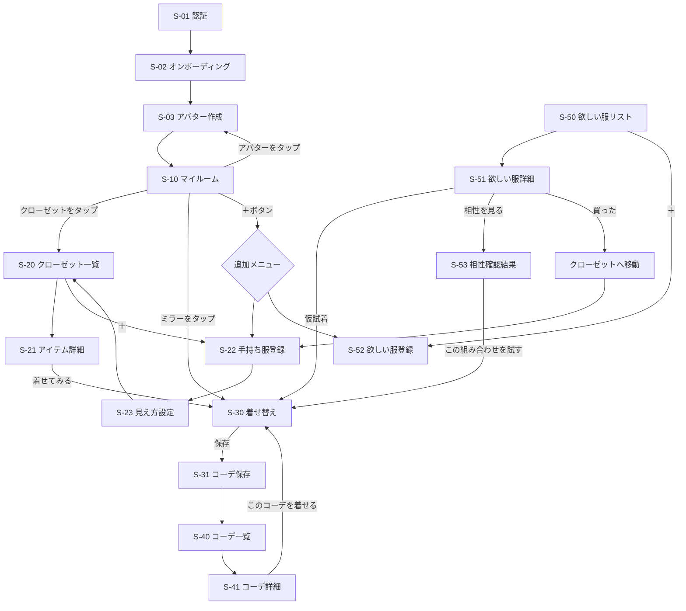

# 02. 画面設計・UI設計

## 1. デザイントーン

- **UI**: 白・黒・グレー中心。余白多め。Appleっぽいシンプルさ。カードUI中心。服が主役。
- **アバター・部屋**: ゲームっぽく可愛い。デフォルメ。でもダサくない。
- フォント: 見出しは太め（Noto Sans JP Bold / SF Pro 相当）、本文はレギュラー
- カラートークン:

```
--bg:            #FAFAFA   (アプリ背景)
--surface:       #FFFFFF   (カード)
--text-primary:  #111111
--text-secondary:#777777
--border:        #EEEEEE
--accent:        #111111   (ボタン等は黒でモード感を出す)
--accent-warm:   #C9B8A8   (ベージュ。部屋・空間系のアクセント)
--danger:        #E05B5B
--score-good:    #4CAF7D
```

- 角丸: カード16px / ボタン12px / サムネ12px
- 影は最小限（Y2pxの薄い影）。線(border)で区切る方が「ファッションアプリっぽさ」が出る

## 2. 画面一覧

| ID | 画面名 | 種別 | MVP |
|---|---|---|---|
| S-01 | スプラッシュ / 認証（サインイン・サインアップ） | フル | ✅ |
| S-02 | オンボーディング（コンセプト紹介3枚） | フル | ✅ |
| S-03 | アバター作成 / 編集 | フル | ✅ |
| S-10 | **マイルーム（ホーム）** | タブ1 | ✅ |
| S-20 | クローゼット一覧 | タブ2 | ✅ |
| S-21 | アイテム詳細 | プッシュ | ✅ |
| S-22 | アイテム登録 / 編集（手持ち服） | モーダル | ✅ |
| S-23 | 服の見え方設定（テンプレ選択 + 色/柄） | 登録フロー内 | ✅ |
| S-30 | **着せ替え（試着ルーム）** | フル | ✅ |
| S-31 | コーデ保存ダイアログ | シート | ✅ |
| S-40 | コーデ一覧 | タブ3 | ✅ |
| S-41 | コーデ詳細 | プッシュ | ✅ |
| S-50 | 欲しい服リスト | タブ4 | ✅ |
| S-51 | 欲しい服詳細（相性確認つき） | プッシュ | ✅ |
| S-52 | 欲しい服登録 / 編集 | モーダル | ✅ |
| S-53 | 相性確認結果 | プッシュ/シート | ✅ |
| S-60 | 設定 / プロフィール | プッシュ | ✅ |
| S-70 | 部屋カスタマイズ | - | 将来 |
| S-71 | コーデ共有 | - | 将来 |

### タブ構成（4タブ）

```
[ 🏠 ルーム ] [ 👕 クローゼット ] [ ✨ コーデ ] [ 🛍 ほしい物 ]
```

着せ替え（S-30）はタブではなく、ルームのミラー / 各所の「着せてみる」から入るフルスクリーン体験にする。
（タブに置くと「管理アプリ」になる。体験の入口は部屋に置くのが世界観の核）

## 3. 画面遷移図



## 4. 各画面のUI設計

### S-10 マイルーム（ホーム）— このアプリの顔

```
┌─────────────────────────┐
│  Fit Collection      ⚙️  │ ← 薄いヘッダー（ロゴ + 設定）
│                         │
│   ╭───────────────────╮ │
│   │    [3D 部屋ビュー]   │ │  画面の70%を部屋が占める
│   │  🪟      🪞        │ │  ・固定カメラ（斜め見下ろし、軽いパララックス）
│   │  🚪クローゼット      │ │  ・アバターが中央に立つ（待機モーション）
│   │      🧍アバター     │ │  ・タップ可能オブジェクトは微発光/バウンス
│   │  🛋   🪴   🧺      │ │
│   ╰───────────────────╯ │
│                         │
│  ┌─────────┐ ┌────────┐ │
│  │ 👕 152着 │ │ ✨ 12件 │ │ ← サマリーカード（クローゼット数 / コーデ数）
│  └─────────┘ └────────┘ │
│  最近の検討中 ▸ [🧥][👟][👜] │ ← 欲しい服の横スクロール
│                  (＋)   │ ← FAB: 服を追加
└─────────────────────────┘
```

インタラクション:
- **クローゼットをタップ** → 扉が開くアニメ → S-20へ
- **ミラーをタップ** → カメラがミラーに寄る → S-30 着せ替えへ
- **アバターをタップ** → リアクションモーション、長押しでアバター編集へ
- 部屋は3Dだが操作は「タップのみ」。自由カメラは混乱のもとなので入れない

### S-20 クローゼット一覧

```
┌─────────────────────────┐
│ クローゼット        🔍 ⇅  │
│ [すべて][トップス][ボトムス][アウター]… │ ← カテゴリチップ(横スクロール)
│ 絞り込み: 色● 季節▾ 系統▾ ♥のみ │
│ ┌────┐ ┌────┐ ┌────┐    │
│ │ 📷 │ │ 📷 │ │ 📷 │    │ ← 3列グリッド。写真が主役
│ │白T  │ │黒スラ│ │ﾃﾞﾆﾑJK│   │    名前は1行、下に色ドット
│ └────┘ └────┘ └────┘    │
│  …                 (＋)  │
└─────────────────────────┘
```

- カードは正方形写真 + 名前1行 + 色ドット + ♥。情報を詰めない
- 空状態: 「クローゼットが空っぽ！最初の1着を登録しよう」+ イラスト + 登録ボタン

### S-21 アイテム詳細

- 上半分: 写真（スワイプで複数枚）
- メタ情報: カテゴリ / 色 / 季節 / 系統タグ / ブランド / メモ
- 「このアイテムを使ったコーデ」横スクロール
- 下部固定ボタン: **［ 着せてみる ］**（黒・幅いっぱい）

### S-22 / S-23 アイテム登録フロー（3ステップ）

```
Step1 写真      : カメラ / ライブラリ → トリミング
Step2 情報      : カテゴリ(必須) → 色(パレット12色) → 季節 → 系統 → ブランド/名前/メモ(任意)
Step3 見え方設定 : テンプレ形状を選ぶ（例: Tシャツ→ 半袖/長袖/オーバーサイズ）
                  → 色を自動提案(Step2の色) → 柄(無地/ボーダー/チェック/写真転写)
                  → プレビューにミニアバターが着た姿を表示 → 完了
```

- 各ステップは1画面1テーマ。戻れる。Step3はデフォルト値が入っているので最短2タップで完了
- 完了時: 「クローゼットに追加されました」トースト + 部屋のクローゼットに吸い込まれるマイクロアニメ（世界観演出）

### S-30 着せ替え（試着ルーム）

```
┌─────────────────────────┐
│ ✕                 リセット │
│                         │
│      [3D アバター]       │ ← 上60%。ミラー前の演出背景
│     ドラッグで回転        │    検討中アイテムには「検討中」バッジ
│                         │
│ [👕][👖][🧥][👟][👜][💍][🧢] │ ← カテゴリタブ
│ ◀ ┌───┐┌───┐┌───┐┌───┐ ▶ │ ← 選択カテゴリの服が横スクロール
│   │なし││ 📷 ││ 📷 ││ 📷 │   │    タップで即着用。検討中は左上🏷
│   └───┘└───┘└───┘└───┘   │
│ [ 🎲 ]      [ コーデを保存 ] │
└─────────────────────────┘
```

- タップ即反映（0.2sのぷにっとしたスケールアニメ）
- ワンピース選択時はトップス/ボトムスタブがグレーアウト
- 服リストの先頭に手持ち服、区切り線の後に検討中アイテム（仮試着導線を常設）

### S-31 コーデ保存

- ボトムシート: サムネプレビュー（3Dスナップショット自動生成）/ コーデ名 / シーン（チップ選択）/ 季節 / メモ
- 検討中アイテムが含まれる場合「検討中アイテムを含むコーデです」表示

### S-50 欲しい服リスト

- セグメント: ［欲しい｜保留｜買った｜いらない］
- カード: 画像 / ブランド / 値段 / 相性スコアバッジ（例: 78点・緑）/ 試着回数
- スワイプアクション: → 買った（クローゼットへ移動提案） / ← いらない

### S-51 欲しい服詳細

- 写真 + 値段 + ブランド + 商品URLボタン
- **相性サマリーカード**（スコア大きく表示 + 「合わせやすい手持ち服」サムネ3つ）
- ボタン: ［仮試着する］［相性をくわしく見る］
- ステータス変更セグメント

### S-53 相性確認結果

```
┌─────────────────────────┐
│ このジャケット、買い？     │
│      ◯ 78点             │ ← 円形スコア
│   「買うべき度: かなりアリ」 │
│ 合わせやすい手持ち服 TOP5  │
│ [📷][📷][📷][📷][📷]      │
│ おすすめコーデ例           │
│ ┌──────────┐            │
│ │ JK+白T+黒スラ+ローファー │ │ ← 自動組成コーデカード
│ │ [この組み合わせを試す]   │ │ → S-30へ（4点装着済みで開く）
│ └──────────┘            │
│ 着回ししやすさ: ★★★★☆     │
│ 「モード・きれいめ寄りのコーデに │
│  使いやすいアイテムです」    │ ← ルールベース生成文
└─────────────────────────┘
```

### S-03 アバター作成

- 上50%: アバターのリアルタイムプレビュー（回転可）
- 下50%: パーツタブ（雰囲気/肌/顔型/目/眉/口/髪型/髪色/体型/身長）
- 各パーツは横スクロールのサムネ選択。色系はパレット
- 「ランダム」ボタンで気軽に始められる
- 完了 → 「あなたの部屋へようこそ」演出でS-10へ

## 5. 共通コンポーネント（UIキット）

| コンポーネント | 用途 |
|---|---|
| `ItemCard` | 服カード（クローゼット/欲しい物/着せ替えリスト共用。sizeとbadge差し替え） |
| `CategoryChips` | カテゴリ横スクロールチップ |
| `ColorDot` / `ColorPalette` | 色表示・色選択 |
| `TagSelector` | 系統・季節などの複数選択チップ |
| `ScoreBadge` / `ScoreRing` | 相性スコア表示（小/大） |
| `PrimaryButton` / `GhostButton` | 黒ベタ / 枠線ボタン |
| `BottomSheet` | 保存・フィルタ等 |
| `AvatarViewer` | 3Dアバター表示（room/tryon/creator/miniの4モード） |
| `RoomScene` | 部屋3Dシーン（タップ可能オブジェクト管理） |
| `EmptyState` | 空状態イラスト+CTA |
| `StepHeader` | 登録フローのステップ表示 |
