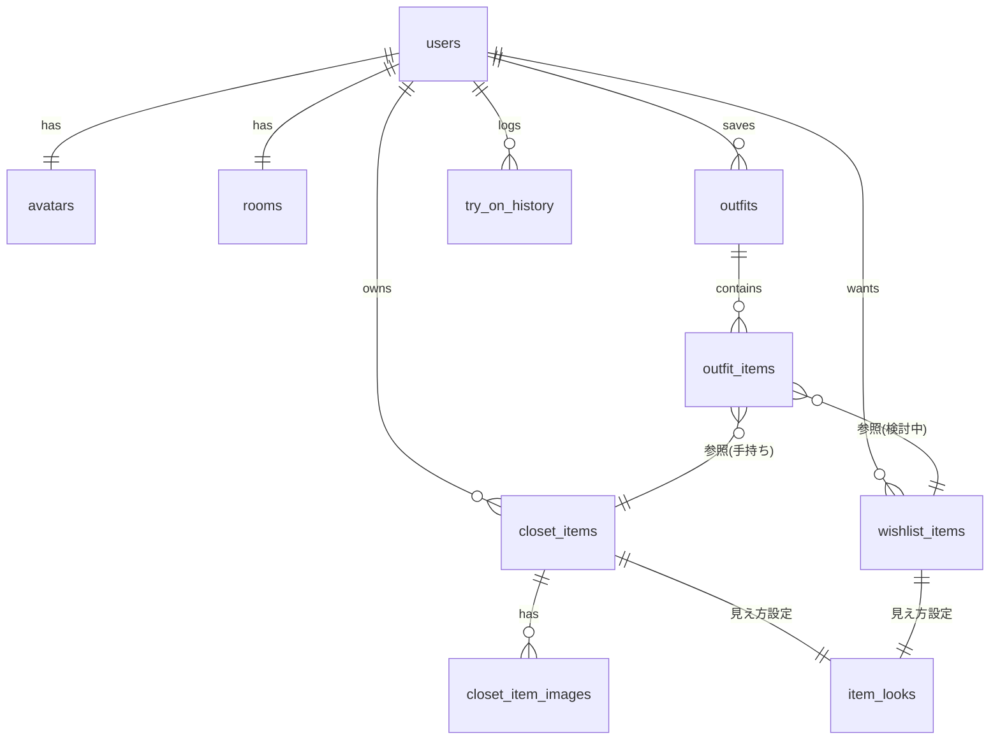

# 04. データ設計（Supabase）

## 1. ER図（概要）



## 2. テーブル定義

> すべてのテーブルに `id uuid primary key default gen_random_uuid()`, `created_at timestamptz default now()`, `updated_at timestamptz default now()` を持つ前提。

### users（= auth.users を拡張する profiles）

```sql
create table public.users (
  id uuid primary key references auth.users(id) on delete cascade,
  nickname text not null default 'わたし',
  onboarding_done boolean not null default false
);
```

### avatars（1ユーザー1体）

```sql
create table public.avatars (
  id uuid primary key default gen_random_uuid(),
  user_id uuid not null unique references public.users(id) on delete cascade,
  -- パーツ選択はすべてプリセットIDで保持（アセット差し替えに強い）
  vibe text not null default 'casual',        -- 雰囲気プリセット
  skin_color text not null default 'skin_03', -- 肌色ID
  face_shape text not null default 'face_round',
  eyes text not null default 'eyes_01',
  brows text not null default 'brows_01',
  mouth text not null default 'mouth_01',
  hair_style text not null default 'hair_short_01',
  hair_color text not null default 'hair_black',
  body_type text not null default 'normal',   -- slim / normal / wide
  height text not null default 'mid'          -- short / mid / tall
);
```

> avatar_customizations は avatars に統合（1:1の細分化は不要）。将来パーツ課金等が必要になったら分離する。

### rooms（1ユーザー1部屋・将来拡張用）

```sql
create table public.rooms (
  id uuid primary key default gen_random_uuid(),
  user_id uuid not null unique references public.users(id) on delete cascade,
  layout_id text not null default 'room_default',
  theme_id text not null default 'theme_beige',
  furniture jsonb not null default '[]'::jsonb  -- 将来の家具配置 [{item,pos,rot}]
);
```

### closet_items（手持ち服）

```sql
create table public.closet_items (
  id uuid primary key default gen_random_uuid(),
  user_id uuid not null references public.users(id) on delete cascade,
  category text not null,            -- tops/bottoms/outer/onepiece/shoes/bag/accessory/hat
  name text,
  brand text,
  color text not null,               -- パレットID (black/white/gray/beige/brown/navy/blue/green/red/pink/purple/yellow)
  styles text[] not null default '{}',   -- 系統タグ (casual/street/mode/kirei/furugi/korean/y2k/simple)
  seasons text[] not null default '{}',  -- spring/summer/autumn/winter
  memo text,
  is_favorite boolean not null default false,
  source_wishlist_id uuid references public.wishlist_items(id), -- 「買った」由来
  look jsonb not null default '{}'::jsonb -- 見え方設定（下記 ItemLook）
);
create index on public.closet_items (user_id, category);
```

### wishlist_items（気になる服）

```sql
create table public.wishlist_items (
  id uuid primary key default gen_random_uuid(),
  user_id uuid not null references public.users(id) on delete cascade,
  category text not null,
  name text,
  brand text,
  color text,
  price integer,                      -- 円
  url text,
  memo text,
  status text not null default 'want', -- want / hold / bought / pass
  compatibility_score integer,         -- 計算結果キャッシュ(0-100)
  compatibility_detail jsonb,          -- {topMatches:[ids], reason:"..."} キャッシュ
  look jsonb not null default '{}'::jsonb
);
create index on public.wishlist_items (user_id, status);
```

### ItemLook（look jsonb の中身・共通スキーマ）

```jsonc
{
  "template_id": "tpl_tops_tshirt_over",  // テンプレメッシュID
  "base_color": "#1A1A1A",
  "pattern": { "type": "border", "color2": "#FFFFFF", "scale": 1.0 },
      // type: solid | border | stripe | check | floral | custom
  "print": { "image_path": "...", "area": "chest" },  // 写真転写（任意）
  "material": "cotton",                    // cotton/denim/leather/knit/nylon
  "morphs": { "length": 0.2, "oversize": 0.6, "sleeve": 0.0, "neck": "crew" }
}
```

> closet と wishlist で同一スキーマにするのが仮試着の肝。着せ替えエンジンは ItemLook だけを見る。

### closet_item_images / wishlist_item_images

```sql
create table public.closet_item_images (
  id uuid primary key default gen_random_uuid(),
  closet_item_id uuid not null references public.closet_items(id) on delete cascade,
  storage_path text not null,
  is_primary boolean not null default false,
  sort_order int not null default 0
);
-- wishlist_item_images も同構造
```

### outfits（コーデ）

```sql
create table public.outfits (
  id uuid primary key default gen_random_uuid(),
  user_id uuid not null references public.users(id) on delete cascade,
  name text not null default '新しいコーデ',
  scene text,                          -- school/date/cafe/hangout/trip/parttime/event/party
  seasons text[] not null default '{}',
  memo text,
  snapshot_path text                   -- 3Dスナップ画像のStorageパス
);
```

### outfit_items（コーデ構成）

```sql
create table public.outfit_items (
  id uuid primary key default gen_random_uuid(),
  outfit_id uuid not null references public.outfits(id) on delete cascade,
  slot text not null,                  -- tops/bottoms/outer/onepiece/shoes/bag/accessory/hat
  closet_item_id uuid references public.closet_items(id) on delete set null,
  wishlist_item_id uuid references public.wishlist_items(id) on delete set null,
  check (num_nonnulls(closet_item_id, wishlist_item_id) = 1)
);
```

### try_on_history（仮試着履歴）

```sql
create table public.try_on_history (
  id uuid primary key default gen_random_uuid(),
  user_id uuid not null references public.users(id) on delete cascade,
  wishlist_item_id uuid not null references public.wishlist_items(id) on delete cascade,
  combined_closet_ids uuid[] not null default '{}',  -- 一緒に着せた手持ち服
  created_at timestamptz default now()
);
```

### マスタ（categories / style_tags）

カテゴリ・系統・色・シーンは**DBテーブルにせずアプリ内の定数**（`src/constants/taxonomy.ts`）にする。
多言語化・運用変更が必要になった時点でテーブル化すれば十分（MVPの可動部を減らす）。

## 3. RLS（全テーブル共通パターン）

```sql
alter table public.closet_items enable row level security;
create policy "own rows" on public.closet_items
  for all using (auth.uid() = user_id) with check (auth.uid() = user_id);
-- users/avatars/rooms/wishlist/outfits/try_on_history も同様
-- 子テーブル(images, outfit_items)は親経由のexistsでチェック
```

サインアップ時に users / avatars / rooms を自動生成する trigger を用意:

```sql
create function public.handle_new_user() returns trigger as $$
begin
  insert into public.users (id) values (new.id);
  insert into public.avatars (user_id) values (new.id);
  insert into public.rooms (user_id) values (new.id);
  return new;
end; $$ language plpgsql security definer;
create trigger on_auth_user_created after insert on auth.users
  for each row execute function public.handle_new_user();
```

## 4. Storage構成

```
bucket: item-photos (private)
  {user_id}/closet/{item_id}/{uuid}.jpg        # 元写真（長辺1280px圧縮済）
  {user_id}/closet/{item_id}/{uuid}_thumb.jpg  # サムネ(400px)
  {user_id}/wishlist/{item_id}/{uuid}.jpg
  {user_id}/prints/{uuid}.png                  # 服テクスチャ転写用切り抜き

bucket: outfit-snapshots (private)
  {user_id}/{outfit_id}.png                    # コーデスナップ

bucket: assets (public, アプリ運営側)
  templates/{template_id}.glb                  # 追加配信用服テンプレ
  avatar/{part_id}.glb / .png                  # 追加髪型・顔テクスチャ
```

- Storage RLS: `(storage.foldername(name))[1] = auth.uid()::text` で本人フォルダのみ
- 画像はアップロード前にクライアントで `expo-image-manipulator` によりリサイズ＆JPEG圧縮
- 表示は署名付きURL + `expo-image` のディスクキャッシュ

## 5. 将来のAI拡張に向けたデータ設計上の布石

- `look` jsonb に `"generated_by": "manual" | "ai_v1"` を持たせ、AI自動設定に差し替え可能
- 背景透過・色抽出・カテゴリ判定は「closet_item_images に処理済み画像のpathを追加する」だけで対応できる構造
- 相性スコアはキャッシュカラム（compatibility_score/detail）に保存しているので、計算主体がクライアント→Edge Function→AIへ変わってもスキーマ変更不要
